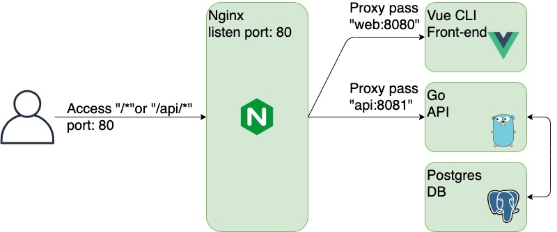

# Vue + Go + Postgres + Nginx on docker

This is the dev-environment for Vue.js, Go, Postgres and Nginx on docker.

This is using the following technologies:

- Environments
  - node:8.16-alpine
  - golang:1.13-alpine
  - postgres:12-alpine
  - nginx:1.17-alpine
- Node.js
  - Vue CLI
  - Vuex
  - Vue Router
- Go
  - realize

## Requirements

The app requires the following to run:

- Docker
- Docker Compose

## Getting Started

To use the environment, clone the repo and execute `docker-compose up`.

```
docker-compose up -d
```

After launching containers, access the `localhost:80`.

Nginx acts as a reverse proxy, passing Vue or Go containers.




Thank you.

## Author

[Hoda](https://hodalog.com)

